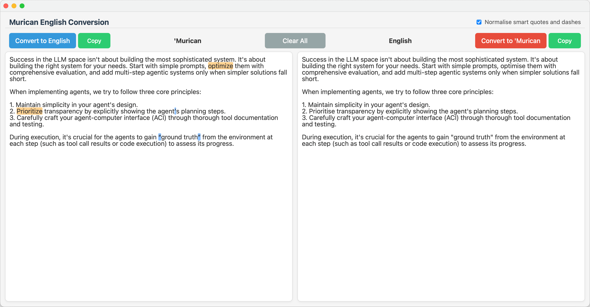
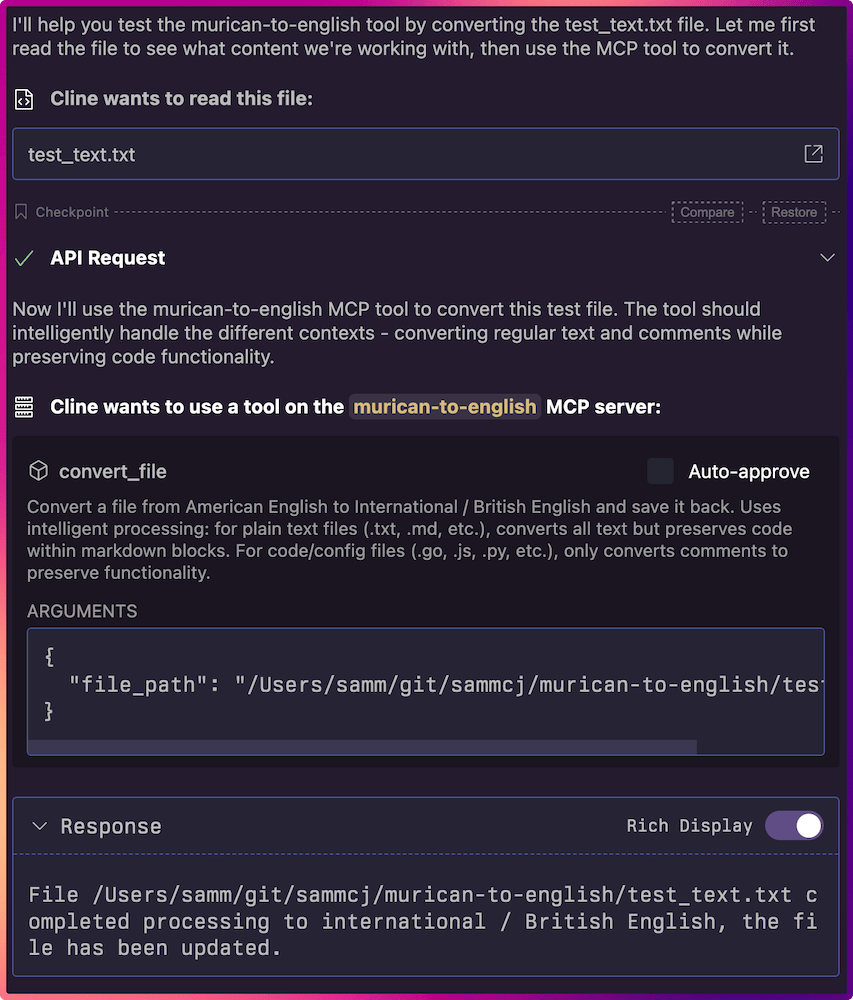
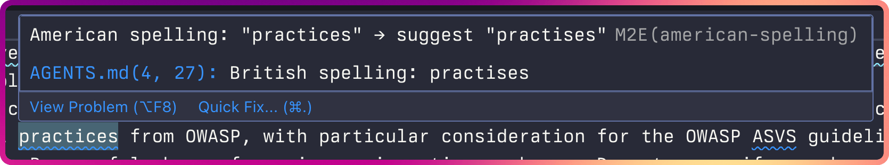

# M2E - 'Murican to English Converter

A lightweight application for converting text from American to International English spellings.

## Features

- Converts pasted text from American to International English
- Freedom Unit to standard metric unit conversion**: Automatically converts imperial units (feet, pounds, °F, etc.) to standard metric equivalents
- Fast and responsive and minimalist interface
- Native desktop application for macOS
- Also gets rid of those pesky "smart" quotes and em-dashes that break everything
- CLI support for file and directory conversion
- Recursive directory processing with intelligent file type detection
- Clipboard conversion
- Report mode with comprehensive analysis, diff output, and CI/CD integration
- MCP (~~Murican Conversion Protocol~~ Model Context Protocol) server for use with AI agents and agentic coding tools
- Code-aware conversion that preserves code syntax while converting comments (BETA)
- Ignore comment directives to exclude specific lines or entire files from conversion
- Configurable unit conversion with user preferences
- macOS Services integration

GUI


MCP Server Use


---

- [M2E - 'Murican to English Converter](#m2e---murican-to-english-converter)
  - [Features](#features)
  - [Installation](#installation)
    - [GUI](#gui)
    - [CLI](#cli)
    - [MCP Server](#mcp-server)
    - [VSCode Extension](#vscode-extension)
  - [How It Works](#how-it-works)
    - [Adding New Words](#adding-new-words)
    - [Ignore Comments](#ignore-comments)
    - [macOS Services Integration](#macos-services-integration)
  - [Freedom Unit Conversion](#freedom-unit-conversion)
    - [Supported Unit Types](#supported-unit-types)
    - [Examples](#examples-1)
    - [Configuration](#configuration)
    - [Interface Integration](#interface-integration)
    - [Troubleshooting](#troubleshooting)
  - [Technology Stack](#technology-stack)
  - [Development](#development)
    - [Prerequisites](#prerequisites)
    - [Development](#development-1)
    - [CLI Usage](#cli-usage)
    - [Clipboard Usage](#clipboard-usage)
    - [Report Mode Usage](#report-mode-usage)
    - [MCP Server Usage](#mcp-server-usage)
    - [API Usage](#api-usage)
    - [Development Mode](#development-mode)
    - [Building](#building)
  - [Project Structure](#project-structure)
  - [License](#license)

Simply paste your freedom text in the left and on the right you'll find the international English spelling.

Note: There is a known issue with typing directly in the freedom text box, I'll get to it eventually but for now pasting works fine.

## Installation

### GUI

- Visit [releases](https://github.com/sammcj/m2e/releases) and download the latest zip

### CLI

```bash
go install github.com/sammcj/m2e/cmd/m2e@HEAD
```

Note: The binary will may installed as `m2e` (not `m2e-cli`) depending on your system.

### MCP Server

```bash
go install github.com/sammcj/m2e/cmd/m2e-mcp@HEAD
```

### VSCode Extension

You can also install m2e as a VSCode extension which provides linting and conversion capabilities directly within VSCode.

The extension includes differential diagnostic severity for contextual words (like license/licence, practice/practise) where confidence may be lower due to context-dependent spelling. Regular American spellings show as Information-level diagnostics, while contextual words show as Hint-level diagnostics by default.

Browse the VSCode marketplace for 'm2e', or browse to the marketplace online: https://marketplace.visualstudio.com/items?itemName=sammcj.m2e-vscode



---

## How It Works

The application uses JSON dictionaries to map between American and English spellings. The conversion logic is implemented in Go, which provides fast and efficient text processing. The frontend is built with React, providing a modern and responsive user interface.

### Adding New Words

There are two ways to add new words to the dictionary:

1. **User Dictionary (Recommended)**: The application automatically creates a user dictionary at `$HOME/.config/m2e/american_spellings.json` when first run. You can edit this file to add your own custom word mappings. This file will be merged with the built-in dictionary, and user entries will override built-in ones.

   Example user dictionary:
   ```json
   {
     "customize": "customise",
     "myword": "myword-british",
     "color": "colour-custom"
   }
   ```

2. **Built-in Dictionary**: For permanent additions to the application, edit the [american_spellings.json](pkg/converter/data/american_spellings.json) file. This requires rebuilding the application as the dictionary is embedded at build time.

The user dictionary provides several advantages:
- No need to rebuild the application
- Survives application updates
- Can override built-in dictionary entries
- Robust error handling - invalid JSON will show a warning but won't break the application
- Automatically created with an example entry on first run

### Ignore Comments

M2E supports linter-style ignore comments to exclude specific lines or entire files from conversion. This is particularly useful when you have American spellings that should be preserved (e.g., in code comments, technical documentation, or quoted material).

#### Ignore Directives

- **`m2e-ignore`** or **`m2e-ignore-line`**: Ignore the same line where the comment appears
- **`m2e-ignore-next`**: Ignore the next line after the comment
- **`m2e-ignore-file`**: Ignore the entire file

#### Supported Comment Syntaxes

Works with all major comment formats:
- `//` (C, C++, Go, JavaScript, TypeScript)
- `#` (Python, Ruby, Shell, YAML, Perl)
- `--` (SQL, Haskell, Ada)
- `%` (LaTeX, MATLAB, PostScript)
- `<!-- -->` (HTML, XML, Markdown)
- `;` (Assembly, Lisp, INI files)
- `'` (VB.NET, VBScript)
- `REM` (Batch files, BASIC)

#### Examples

**Same-line ignore:**
```go
// This comment about color will not be converted m2e-ignore
fmt.Println("Processing colors") // This comment will be converted to colours
```

**Next-line ignore:**
```python
# m2e-ignore-next
# This comment about color will be ignored
def process_colors():  # This comment will be converted to colours
    pass
```

**File-level ignore:**
```sql
-- m2e-ignore-file
-- This entire SQL file will be ignored
SELECT color, flavor FROM american_table;
```

#### Integration

Ignore comments work seamlessly with:
- **Code-aware processing**: Preserves code functionality while respecting ignore directives
- **All interfaces**: GUI, CLI, API server, and MCP server
- **Unit conversion**: Ignored content also skips unit conversion
- **Contextual word detection**: Ignored content bypasses advanced grammar-aware conversion

### macOS Services Integration

The application integrates with macOS Services, allowing you to convert text from any application.

1. **Convert selected text**: Select text in any application, right-click, and choose "Convert to British English" from the Services menu.
2. **Convert files**: Right-click on a file in Finder, and select "Convert File to British English" from the Services menu to convert the file's contents.

This feature makes it easy to convert text without having to open the application directly. After installation, you may need to log out and log back in for the services to be registered with macOS.

## Freedom Unit Conversion

M2E includes intelligent imperial-to-metric unit conversion that works alongside spelling conversion. The feature is designed to be code-aware, converting units only in appropriate contexts while preserving code functionality.

### Supported Unit Types

- **Length**: feet, inches, yards, miles → metres, centimetres, kilometres
- **Mass**: pounds, ounces, tons → kilograms, grams, tonnes
- **Volume**: gallons, quarts, pints, fluid ounces → litres, millilitres
- **Temperature**: Fahrenheit → Celsius
- **Area**: square feet, acres → square metres, hectares

### Examples

**Basic conversions:**
```
"The room is 12 feet wide" → "The room is 3.7 metres wide"
"Temperature was 75°F" → "Temperature was 24°C"
"The package weighs 5 pounds" → "The package weighs 2.3 kg"
"I drove 10 miles to work" → "I drove 16 km to work"
```

**Code-aware processing:**
```go
// The buffer should be 1024 bytes in size (no conversion - bytes not imperial)
// Set the width to 100 inches for display → Set the width to 254 cm for display
const ROOM_WIDTH_FEET = 12  // ← No conversion in variable names or values
```

**Smart detection (avoids idioms):**
```
"I'm miles away from home" → (no conversion - idiomatic usage)
"They moved inch by inch" → (no conversion - idiomatic usage)
"The room is 6 feet tall" → "The room is 1.8 metres tall" (converts measurements)
```

### Configuration

Unit conversion can be customised through a configuration file at `$HOME/.config/m2e/unit_config.json`.

**Create example configuration:**

The configuration file is automatically created with default values when first needed. You can manually create and edit `$HOME/.config/m2e/unit_config.json` to customise unit conversion behaviour.

**Configuration options:**

```json
{
  "enabled": true,
  "enabledUnitTypes": ["length", "mass", "volume", "temperature", "area"],
  "precision": {
    "length": 1,
    "mass": 1,
    "volume": 1,
    "temperature": 0,
    "area": 1
  },
  "customMappings": {
    "customize": "customise"
  },
  "excludePatterns": [
    "miles?\\s+(?:away|apart|from\\s+home|ahead)",
    "inch\\s+by\\s+inch"
  ],
  "preferences": {
    "preferWholeNumbers": true,
    "maxDecimalPlaces": 2,
    "temperatureFormat": "°C",
    "useSpaceBetweenValueAndUnit": true,
    "roundingThreshold": 0.1
  },
  "detection": {
    "minConfidence": 0.5,
    "maxNumberDistance": 3,
    "detectCompoundUnits": true,
    "detectWrittenNumbers": true
  }
}
```

**Key configuration options:**

- `enabled`: Enable/disable all unit conversion
- `enabledUnitTypes`: Array of unit types to convert
- `precision`: Decimal places for each unit type
- `customMappings`: Custom unit mappings (American → British)
- `excludePatterns`: Regex patterns to exclude from conversion
- `preferences.preferWholeNumbers`: Round to whole numbers when close (e.g., 2.98 → 3)
- `preferences.temperatureFormat`: Use "°C" or "degrees Celsius"
- `detection.minConfidence`: Minimum confidence (0.0-1.0) to convert a detected unit
- `detection.maxNumberDistance`: Maximum words between number and unit

### Interface Integration

Unit conversion is available across all interfaces:

**GUI**: Toggle unit conversion in the application interface

**CLI**: Use the `-units` flag
```bash
m2e -units "The room is 12 feet wide"
echo "Temperature was 75°F" | m2e -units
```

**MCP Server**: Add `convert_units` parameter
```json
{
  "name": "convert_text",
  "arguments": {
    "text": "The room is 12 feet wide",
    "convert_units": "true"
  }
}
```

**API Server**: Include `convert_units` in request body
```json
{
  "text": "The room is 12 feet wide",
  "convert_units": true
}
```

### Troubleshooting

For detailed troubleshooting help, see the [Unit Conversion Troubleshooting Guide](docs/UNIT_CONVERSION_GUIDE.md).

**Quick fixes:**

1. **Units not converting**: Check if unit conversion is enabled and the unit type is in `enabledUnitTypes`
2. **Unexpected conversions**: Add exclusion patterns for specific phrases in `excludePatterns`
3. **Wrong precision**: Adjust precision settings for each unit type
4. **Configuration errors**: Validate JSON syntax and check error messages

**Reset to defaults:**
```bash
# Remove user configuration to use defaults
rm ~/.config/m2e/unit_config.json
```

## Technology Stack

- **Backend**: Go >= 1.24
- **Frontend**: React >= 18
- **Framework**: Wails v2.10
- **Build System**: Go modules and npm

## Development

### Prerequisites

- Go 1.24 or later
- Node.js 22 or later
- Wails CLI v2.10.1 or later

### Development

1. Clone the repository
   ```bash
   git clone https://github.com/sammcj/m2e.git
   cd m2e
   ```
2. Install dependencies
   ```bash
   go mod tidy
   ```
3. Build
   ```bash
   make build
   ```

The project includes a Makefile for common development tasks:

```bash
make          # Run lint, test, and build (default)
make lint     # Run linter and format check
make test     # Run all tests
make build    # Build the application
make clean    # Clean build artifacts
```

### CLI Usage

The application can be run from the command line to convert files or piped text.

**Build the CLI from source:**
```bash
make build-cli
```

**Convert text:**
```bash
m2e "I love color and flavor"                # Convert text to stdout
echo "I love color" | m2e                    # Convert piped text
```

**Convert a file:**
```bash
m2e document.txt                              # Convert file to stdout
m2e -o converted.txt document.txt             # Convert file to output file
m2e -units document.txt                       # Convert with unit conversion
```

**Convert a directory (all plain text files recursively):**
```bash
m2e /path/to/directory                        # Process all text files in-place
m2e -units /path/to/directory                 # Process with unit conversion
```

**Legacy usage (for backwards compatibility):**
```bash
m2e -input yourfile.txt -output converted.txt # Legacy flags still work
```

**CLI Options:**
- `-o, -output`: Output file to write to (writes to stdout if not specified)
- `-units`: Freedom Unit Conversion (default: false)
- `-no-smart-quotes`: Disable smart quote normalisation (default: false)
- `-report`: Enable analysis mode instead of conversion
- `-h, -help`: Show help message

**Legacy Options (backwards compatibility):**
- `-input`: Input file to convert (use positional argument instead)

**Directory Processing:**
When a directory path is provided instead of a file:
- Recursively processes all plain text files (detects file types intelligently)
- Skips binary files, hidden files, and common non-text formats
- Supports both report mode and in-place editing
- Shows clear progress indicators for which files are being processed

**Report Mode Options:**
- `-report`: Enable report mode with analysis and formatted output
- `-diff`: Show git-style diff of changes (report mode only)
- `-text`: Show converted text output (report mode only)
- `-markdown`: Show markdown-rendered output (report mode, default: true)
- `-stats`: Show conversion statistics (report mode, default: true)
- `-width`: Set output width for formatting (report mode, default: 80)
- `-exit-on-change`: Exit with code 1 if changes are detected (report mode only)

### Clipboard Usage

The CLI can also be used to convert the contents of the clipboard directly.

**Convert clipboard text:**

Set the `M2E_CLIPBOARD` environment variable to `1` or `true` and call the CLI:

```bash
M2E_CLIPBOARD=1 m2e
```

The converted text will be copied back to the clipboard.

### Report Mode Usage

The CLI includes a comprehensive report mode for detailed analysis and formatted output of text conversion operations, perfect for CI/CD pipelines and detailed reporting.

**Basic report mode usage:**

```bash
m2e -report document.md                    # Analyse single file with default output
m2e -report /path/to/directory              # Analyse all text files in directory
echo "I love color" | m2e -report         # Analyse piped text
```

If built from source:
```bash
./build/bin/m2e -report document.md
./build/bin/m2e -report /path/to/directory
echo "I love color" | ./build/bin/m2e -report
```

**Output options:**
```bash
m2e -report -diff document.md              # Show git-style diff for single file
m2e -report -diff /path/to/directory        # Show diffs for all files with changes
m2e -report -text document.md              # Show converted text
m2e -report -markdown document.md          # Show markdown-rendered output (default)
m2e -report -stats document.md             # Show conversion statistics (default)
```

**Unit conversion in report mode:**
```bash
m2e -report -units "The room is 12 feet wide"
```

**CI/CD integration:**
```bash
m2e -report -exit-on-change README.md      # Exit with code 1 if changes needed (single file)
m2e -report -exit-on-change /docs/         # Exit with code 1 if any files need changes (directory)
```

**Comprehensive analysis:**
```bash
m2e -report -diff -stats -units document.md
```

**Report mode exit codes:**
- `0`: Success (no errors)
- `1`: Changes detected (only when `-exit-on-change` is used)
- `2`: Error occurred

---

### MCP Server Usage

The application can be run as an MCP (Model Context Protocol) server to provide conversion functionality to AI agents and tools.

**Build the MCP server from source:**
```bash
make build-mcp
```

**Run the MCP server in Streamable HTTP mode:**

If installed via `go install`:
```bash
m2e-mcp
```

If built from source:
```bash
./build/bin/m2e-mcp
```
The server will serve up on /mcp and start on port 8081 by default. You can change this by setting the `MCP_PORT` environment variable.

MCP client configuration:

```json
{
  "mcpServers": {
    "m2e": {
      "timeout": 60,
      "type": "streamableHttp",
      "url": "http://localhost:8081/mcp",
      "autoApprove": [
        "convert_text"
      ]
    }
  }
}
```

**Run the MCP server in STDIO mode:**

If installed via `go install`:
```bash
MCP_TRANSPORT=stdio m2e-mcp
```

If built from source:
```bash
MCP_TRANSPORT=stdio ./build/bin/m2e-mcp
```

**Available Tools:**
- `convert_text`: Converts American English text to British English with optional unit conversion
  - Parameters:
    - `text` (string, required) - The text to convert
    - `convert_units` (string, optional) - Freedom Unit Conversion ("true"/"false", default: "false")
    - `normalise_smart_quotes` (string, optional) - Normalise smart quotes to regular quotes ("true"/"false", default: "true")
- `convert_file`: Converts a file from American English to British English and saves it back
  - Parameters:
    - `file_path` (string, required) - The fully qualified path to the file to convert
    - `convert_units` (string, optional) - Freedom Unit Conversion ("true"/"false", default: "false")
    - `normalise_smart_quotes` (string, optional) - Normalise smart quotes to regular quotes ("true"/"false", default: "true")
  - Uses intelligent processing: for plain text files (.txt, .md, etc.), converts all text but preserves code within markdown blocks. For code/config files (.go, .js, .py, etc.), only converts comments to preserve functionality.

**Available Resources:**
- `dictionary://american-to-british`: Access to the American-to-British dictionary mapping

**Example MCP client usage:**

Convert text:
```json
{
  "jsonrpc": "2.0",
  "method": "tools/call",
  "params": {
    "name": "convert_text",
    "arguments": {
      "text": "I love color and flavor. The room is 12 feet wide.",
      "convert_units": "true"
    }
  },
  "id": 1
}
```

Convert a file:
```json
{
  "jsonrpc": "2.0",
  "method": "tools/call",
  "params": {
    "name": "convert_file",
    "arguments": {
      "file_path": "/path/to/your/file.txt",
      "convert_units": "true",
      "normalise_smart_quotes": "true"
    }
  },
  "id": 2
}
```

---

### API Usage

The application can be run as an API server to provide conversion functionality programmatically.

**Install the API server via go install:**
```bash
go install github.com/sammcj/m2e/cmd/m2e-server@HEAD
```

**Build the server from source:**
```bash
make build-server
```

**Run the server:**

If installed via `go install`:
```bash
m2e-server
```

If built from source:
```bash
./build/bin/m2e-server
```
The server will start on port 8080 by default. You can change this by setting the `API_PORT` environment variable.

**Endpoints:**

- `POST /api/v1/convert`

  Converts text from American to British English with optional unit conversion.

  **Request Body:**
  ```json
  {
    "text": "I love color and flavor. The room is 12 feet wide.",
    "convert_units": true,
    "normalise_smart_quotes": true
  }
  ```

  **Parameters:**
  - `text` (string, required): The text to convert
  - `convert_units` (boolean, optional): Freedom Unit Conversion (default: false)
  - `normalise_smart_quotes` (boolean, optional): Normalise smart quotes to regular quotes (default: true)

  **Response:**
  ```json
  {
    "text": "I love colour and flavour. The room is 3.7 metres wide.",
    "changes": [
      {
        "position": 7,
        "original": "color",
        "converted": "colour",
        "type": "spelling",
        "is_contextual": false
      },
      {
        "position": 17,
        "original": "flavor",
        "converted": "flavour",
        "type": "spelling",
        "is_contextual": false
      },
      {
        "position": 35,
        "original": "12 feet",
        "converted": "3.7 metres",
        "type": "unit",
        "is_contextual": false
      }
    ]
  }
  ```

  **Response Fields:**
  - `text` (string): The converted text
  - `changes` (array, optional): Detailed information about each change made
    - `position` (number): Character position in original text where change occurred
    - `original` (string): Original text that was changed
    - `converted` (string): New text after conversion
    - `type` (string): Type of change ("spelling" or "unit")
    - `is_contextual` (boolean, optional): Whether this is a contextual word change (e.g., license/licence) where context determines correct form

- `GET /api/v1/health`

  Returns a 200 OK status if the server is running.

---

### Development Mode

To run the application in development mode:

```bash
wails dev
```

This will start the application with hot reloading for both frontend and backend changes.

### Building

To build the application for production:

```bash
make build
# or
./build-macos.sh
```

This will create a native application optimised for Apple Silicon in the `build/bin` directory.

---

## Project Structure

```
m2e/
├── build/                # Build artifacts
├── cmd/                  # Command-line applications
│   ├── m2e/             # CLI application
│   ├── m2e-server/      # HTTP API server
│   └── m2e-mcp/         # MCP server
├── frontend/             # Frontend code using React
│   ├── src/
│   │   ├── App.jsx       # Main application component
│   │   └── App.css       # Application styles
│   ├── index.html
│   └── package.json
├── pkg/                  # Go packages
│   ├── converter/        # Core conversion logic
│   │   ├── converter.go  # Main conversion functionality
│   │   ├── dictionary.go # Dictionary loading and management
│   │   ├── unit_processor.go # Unit conversion processing
│   │   ├── utils.go      # Helper utility functions
│   │   ├── codeaware.go  # Code-aware conversion with syntax highlighting
│   │   ├── ignore_comments.go # Ignore comment processing
│   │   ├── contextual_word_detector.go # Context-aware word detection
│   │   ├── contextual_word_patterns.go # Contextual word patterns
│   │   ├── contextual_word_config.go   # Contextual word configuration
│   │   ├── sentence_aware_converter.go # Sentence-aware processing
│   │   ├── unit_converter.go # Unit conversion logic
│   │   ├── unit_detector.go  # Unit detection patterns
│   │   ├── unit_patterns.go  # Unit conversion patterns
│   │   ├── unit_config.go    # Unit conversion configuration
│   │   └── data/         # JSON dictionaries
│   ├── fileutil/         # File processing utilities
│   └── report/           # Report generation and analysis
├── tests/                # Comprehensive test suite
│   ├── converter_test.go # Basic conversion tests
│   ├── contextual_word_test.go # Contextual word detection tests
│   ├── ignore_comments_test.go # Ignore comment functionality tests
│   ├── unit_*_test.go    # Unit conversion tests
│   ├── cli_test.go       # CLI functionality tests
│   ├── api_server_test.go # API server tests
│   ├── mcp_*_test.go     # MCP server tests
│   └── chroma_test.go    # Syntax highlighting tests
├── vscode-extension/     # VSCode extension
│   ├── src/              # TypeScript source code
│   │   ├── providers/    # Diagnostic and code action providers
│   │   ├── services/     # API client and server management
│   │   └── commands/     # Extension commands
│   └── package.json      # Extension manifest
├── Makefile              # Development automation
├── main.go               # Main GUI application entry
├── app.go                # Application setup and binding to frontend
└── wails.json            # Wails configuration
```
## License

- Copyright © 2025 Sam McLeod
- [MIT](LICENSE)
