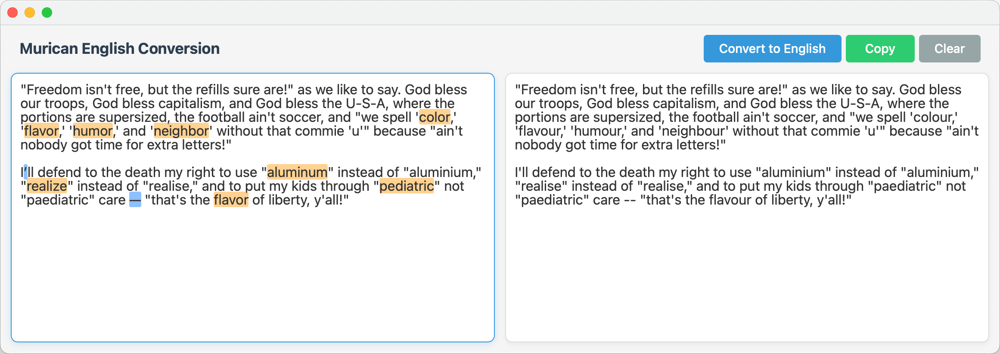

# Freedom Translator - 'Murican to English Converter

A modern, lightweight application for converting text from American to International English spellings.

## Features

- Converts pasted text from American to International English
- Fast and responsive and minimalist interface
- Native desktop application for macOS
- Also gets rid of those pesky "smart" quotes and em-dashes that break everything
- CLI support for file conversion
- Code-aware conversion that preserves code syntax while converting comments (BETA)
- macOS Services integration (WIP)

Coming soon:
- API for programmatic access to conversion functionality
- MCP (~~Murican Conversion Protocol~~ Model Context Protocol) for integration with AI / Agents



Simply paste your freedom text in the left and on the right you'll find the international English spelling.

Note: There is a known issue with typing directly in the freedom text box, I'll get to it eventually but for now pasting works fine.

## Installation

- Visit [releases](https://github.com/sammcj/murican-to-english/releases) and download the latest zip

---

## Technology Stack

- **Backend**: Go >= 1.24
- **Frontend**: React >= 18
- **Framework**: Wails v2.10
- **Build System**: Go modules and npm

## Development

### Prerequisites

- Go 1.24 or later
- Node.js 22 or later
- Wails CLI v2.10.1 or later

### Setup

1. Install the Wails CLI:

```bash
go install github.com/wailsapp/wails/v2/cmd/wails@v2.10.1
```

2. Clone the repository:

```bash
git clone https://github.com/sammcj/murican-to-english.git
cd murican-to-english
```

3. Install dependencies:

```bash
wails dev
```

### Development Commands

The project includes a Makefile for common development tasks:

```bash
make          # Run lint, test, and build (default)
make lint     # Run linter and format check
make test     # Run all tests
make build    # Build the application
make clean    # Clean build artifacts
```

### Development Mode

To run the application in development mode:

```bash
wails dev
```

This will start the application with hot reloading for both frontend and backend changes.

### Building

To build the application for production:

```bash
make build
# or
./build-macos.sh
```

This will create a native application optimised for Apple Silicon in the `build/bin` directory.

For more detailed build instructions, including GitHub Actions automated builds and universal binary creation, see [BUILD.md](BUILD.md).

## Project Structure

```
murican-to-english/
├── build/                # Build artifacts
├── frontend/             # Frontend code using React
│   ├── src/
│   │   ├── App.jsx       # Main application component
│   │   └── App.css       # Application styles
│   ├── index.html
│   └── package.json
├── pkg/
│   └── converter/        # Go package for conversion logic
│       ├── converter.go  # Main conversion functionality
│       ├── codeaware.go  # Code-aware conversion with syntax highlighting
│       └── data/         # JSON dictionaries
├── tests/                # Test files
│   ├── converter_test.go # Basic conversion tests
│   ├── codeaware_test.go # Code-aware functionality tests
│   └── chroma_test.go    # Syntax highlighting tests
├── Makefile              # Development automation
├── main.go               # Main application entry
├── app.go                # Application setup and binding to frontend
└── wails.json            # Wails configuration
```

## How It Works

The application uses JSON dictionaries to map between American and English spellings. The conversion logic is implemented in Go, which provides fast and efficient text processing. The frontend is built with React, providing a modern and responsive user interface.

### macOS Services Integration

The application integrates with macOS Services, allowing you to:

1. **Convert selected text**: Select text in any application, right-click, and choose "Convert to British English" from the Services menu.
2. **Convert files**: Right-click on a file in Finder, and select "Convert File to British English" from the Services menu to convert the file's contents.

This feature makes it easy to convert text without having to open the application directly. After installation, you may need to log out and log back in for the services to be registered with macOS.

## License

- Copyright © 2025 Sam McLeod
- [MIT](LICENSE)
